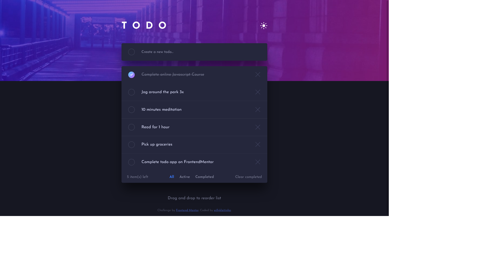

# Frontend Mentor - Todo app solution

This is a solution to the [Todo app challenge on Frontend Mentor](https://www.frontendmentor.io/challenges/todo-app-Su1_KokOW). Frontend Mentor challenges help you improve your coding skills by building realistic projects. 

## Table of contents

- [Overview](#overview)
  - [The challenge](#the-challenge)
  - [Screenshot](#screenshot)
  - [Links](#links)
- [My process](#my-process)
  - [Built with](#built-with)
  - [What I learned](#what-i-learned)
  - [Continued development](#continued-development)
  - [Useful resources](#useful-resources)
- [Author](#author)

## Overview

### The challenge

Users should be able to:

- View the optimal layout for the app depending on their device's screen size
- See hover states for all interactive elements on the page
- Add new todos to the list
- Mark todos as complete
- Delete todos from the list
- Filter by all/active/complete todos
- Clear all completed todos
- Toggle light and dark mode
- **Bonus**: Drag and drop to reorder items on the list

### Screenshot

### Links

- Solution URL: [on Frontend Mentor](https://www.frontendmentor.io/solutions/responsive-todo-app-using-pure-js-and-the-html5-drag-and-drop-api-yA3uqWSRR)
- Live Site URL: [on Github Pages](https://willykleitinho.github.io/todo-app/)

## My process
 
### Built with

- Semantic HTML5 markup
- CSS custom properties
- Flexbox
- Mobile-first workflow
- Pure JavaScript

### What I learned

In this project, I practiced writing semantically correct webapps and better structuring the CSS rules. I've also learned to not rush, and really think about the program structure before actually coding.
I learned how to use the HTML5 Drag and Drop API, although  it doesn't seem to work properly across different browsers and devices.

### Continued development

I'll learn more about different implementations of the drag and drop functionality, and the different libraries that already exist.

### Useful resources

- [Drag and Drop Raiz com a API do HTML, CSS e JavaScript | Rocketseat](https://www.youtube.com/watch?v=6wn8hpUcEcM) - Drag and Drop tutorial using pure JS (PT-BR).
- [JavaScript Drag & Drop Sortable List Project | Traversy Media](https://www.youtube.com/watch?v=wv7pvH1O5Ho) - Another Drag and Drop tutorial I watched.

## Author

- Github - [willykleitinho](https://github.com/willykleitinho)
- Frontend Mentor - [@willykleitinho](https://www.frontendmentor.io/profile/willykleitinho)
